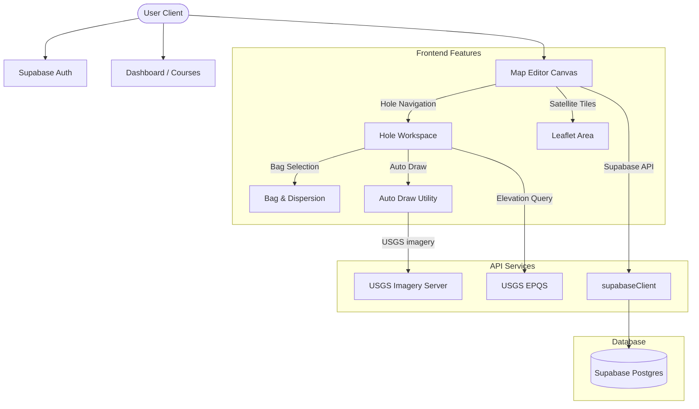

# 🏛️ Open-Yardage Architect: Codebase Architecture

This document provides a comprehensive technical overview of the codebase architecture, file organization, features, database schema abstractions, and state flow for the **Open-Yardage Architect** application. It serves as a guide for developers onboarding or extending functionality.

---

## 1. Project Overview & Tech Stack

**Open-Yardage Architect** is a browser-based application designed for golf course mapping, visualization, and strategic play planning.

- **Frontend Core**: React 19, JavaScript (ES6+), React Router 7.
- **Styling**: Tailwind CSS for component styling, supplemented by Custom CSS / MUI themes.
- **UI Components**: Material UI (MUI) v9 for layout containers, panels, and forms.
- **Map Engine**: Leaflet v1.9, React-Leaflet v5, Leaflet Rotate, and Leaflet Geoman for geographic rendering and drawing controls.
- **Backend & Storage**: Supabase (Postgres with PostGIS extension for spatial queries, and authentication).
- **Tooling/Build**: Vite, Vitest for unit testing.

---

## 2. Codebase Organization

The codebase is organized following a **feature-based architecture** under `src/features`, combined with centralized `services`, `hooks`, and `utils`.

```text
course-management-tool/
├── .agents/                 # AI skill blueprints & scripts
├── docs/                    # Technical references & schema docs
├── scripts/                 # Maintenance scripts (e.g. database schema generator)
├── src/
│   ├── assets/              # Static assets (images, logos)
│   ├── components/          # App-wide shared/core components (Auth, Header)
│   ├── features/            # Modular feature folders
│   │   ├── bag/             # Club inventory & dispersion modeling
│   │   ├── course/          # Tee sets, scorecards, course details
│   │   └── map/             # Map area, overlays, drawing tools, workspace sidebar
│   ├── hooks/               # Central custom React hooks
│   ├── pages/               # Main routed views (Dashboard, Profile, Courses)
│   ├── services/            # API wrappers (Supabase RPCs, REST endpoints)
│   ├── utils/               # App-wide utility methods (colors, formatting)
│   ├── App.jsx              # Main routing & state initialization
│   ├── main.jsx             # Entrypoint file
│   ├── theme.js             # Material UI theme overrides
│   └── supabaseClient.js    # Initialized Supabase client instance
├── package.json             # Core dependencies and scripts
└── vite.config.js           # Vite configuration
```

---

## 3. High-Level Features & Subsystems



### 3.1 Course Management (`src/features/course`)
Manages course attributes, scorecard rows, tee boxes, ratings, slopes, and hole parameters (par, handicap).
- **Key Files**: 
  - [CourseDetails.jsx](file:///c:/Users/Jacob.Evenson/course-managment-tool/course-management-tool/src/features/course/components/CourseDetails.jsx): Holds forms for managing metadata, tees, and yardage matrices.
  - [CourseScorecard.jsx](file:///c:/Users/Jacob.Evenson/course-managment-tool/course-management-tool/src/features/course/components/CourseScorecard.jsx): Renders a traditional 18-hole scorecard comparing tee sets, pars, and handicaps.

### 3.2 Bag & Club Management (`src/features/bag`)
Tracks the player's clubs, including carry/total yardages and dispersion modeling metrics.
- **Key Files**:
  - [BagClubList.jsx](file:///c:/Users/Jacob.Evenson/course-managment-tool/course-management-tool/src/features/bag/components/BagClubList.jsx): Displays custom cards for the player's bag, allowing inline edit operations.
  - [DispersionPanel.jsx](file:///c:/Users/Jacob.Evenson/course-managment-tool/course-management-tool/src/features/bag/components/dispersion/DispersionPanel.jsx): Computes and visualizes on-canvas dispersion ellipses representing shot spreads based on left/right/short/long miss variables.

### 3.3 Interactive Map Canvas (`src/features/map`)
The editor core. It uses Leaflet to render satellite overlays, allowing administrators to position green-center/tee-back markers and draw boundary polygons (fairways, bunkers, water), while players map custom strategic routes.
- **Key Files**:
  - [MapCanvas.jsx](file:///c:/Users/Jacob.Evenson/course-managment-tool/course-management-tool/src/features/map/components/MapCanvas.jsx): Orchestrator connecting UI events, active map parameters, and API save pipelines.
  - [MapArea.jsx](file:///c:/Users/Jacob.Evenson/course-managment-tool/course-management-tool/src/features/map/components/MapArea.jsx): Renders the interactive Leaflet map instance and custom drawing plugins.
  - [HoleWorkspace/index.jsx](file:///c:/Users/Jacob.Evenson/course-managment-tool/course-management-tool/src/features/map/components/HoleWorkspace/index.jsx): Sidebar panels including tool buttons, segment distances, and properties.

### 3.4 Image-Based Auto Draw (`src/features/map/utils/autoDrawRegion.js`)
An experimental feature that fetches satellite images directly from USGS servers based on seed points clicked on the map. It runs a flood-fill algorithm in memory to trace a boundary matching color tolerances, simplifies the resulting contour, and returns a GeoJSON Polygon.

### 3.5 Elevation & Plays-Like Service
Combines horizontal PostGIS distance with vertical delta.
- **USGS EPQS lookup**: `fetchElevation.js` calls the USGS endpoint to resolve elevation in meters and converts it to yards.
- **Database logic**: The RPC `calculate_plays_like_distance` reads coordinates and elevations, converting geometry bounds to yards and applying the Pythagorean theorem $\sqrt{\text{distance}^2 + \Delta z^2}$.

---

## 4. State Management and Data Flow

Data is distributed throughout the app via **specialized React hooks** located in `src/hooks`. These handle local React states, optimistic updates, and interface directly with the services.

### 4.1 Custom Hooks Index

| Hook Name | Target Feature | Core Responsibility |
| :--- | :--- | :--- |
| `useClubs` | Bag | Fetches, adds, updates, and removes clubs from the database. |
| `useCourse` | Course | Loads comprehensive details, scorecard values, yardages, and tee setups. |
| `useHoles` | Map / Course | Manages active markers, coordinates optimistic updates for marker moves, fetches elevations on the fly, and updates local array states. |
| `useMapTools` | Map | Handles drawing state, tool select triggers, and imagery tolerance settings. |
| `useMapTerrainOverlays` | Map | Filters, saves, and updates custom drawn terrain regions linked to holes. |
| `useProfile` | User | Loads player profile parameters (handicap, dexterity, username). |
| `usePlanningAreas` | Strategy | Loads and manages player planning/safety shapes for specific holes. |

### 4.2 Optimistic UI Update Pattern
For mapping interactions (dragging markers), the app uses an **optimistic UI pattern** in [useHoles.js](file:///c:/Users/Jacob.Evenson/course-managment-tool/course-management-tool/src/hooks/useHoles.js):
1. User moves marker on the canvas.
2. `dragend` fires, triggering `movePlanningMarker` or `moveMapMarker`.
3. The hook immediately updates local `holes` state with the new latitude/longitude coordinates (minimizing lag).
4. An async IIFE runs in the background:
   - Queries `fetchElevation(lat, lng)` (API call).
   - Calls the `mapApi` RPC to write the changes to the database.
   - Merges the returned server row (containing finalized ID and resolved elevation) into the state.
5. If the database save fails, the optimistic update is rolled back, and an error message is set in the header banner.

---

## 5. Database Schema Abstraction

The database schema leverages views to decouple UI queries from primary tables, easing migration paths.

```text
[holes] ───< [hole_map_markers] ─── (geography point & elevation)
   │
   ├───────< [hole_planning_markers] ─── (strategy segments & elevation)
   │
   ├───────< [hole_planning_areas] ─── (geojson boundary & styles)
   │
   └───────< [terrain_overlay_holes] >── [terrain_overlays] ─── (polygons)
```

- **Views**:
  - `courses_view`: Aggregates active courses and includes lat/lng conversions.
  - `hole_map_markers_view`: Joins geographic markers to coordinate scales and exposes elevation.
  - `hole_planning_markers_view`: Exposes user strategy paths.
  - `terrain_overlays_view`: Joins polygons to course metadata.

For detailed mappings of tables, fields, and constraints, refer to [DATABASE_SCHEMA.md](DATABASE_SCHEMA.md).
